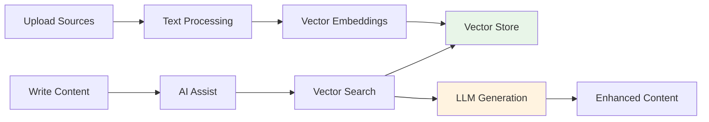

# 🚀 RAG-Powered Content Writer

An intelligent content writing platform that uses **Retrieval-Augmented Generation (RAG)** to create authentic, well-sourced content by automatically integrating information from your uploaded documents, URLs, and images.

## 🌟 **What Makes This Special**

Unlike traditional AI writing tools that rely solely on training data, our RAG-powered system:
- **📚 Uses YOUR sources** - Automatically references your uploaded PDFs, scraped URLs, and OCR'd screenshots
- **🔍 No token limits** - Processes unlimited sources by intelligently retrieving only relevant chunks
- **✨ Authentic responses** - All content grounded in your actual documents with proper attribution
- **🧠 Semantic understanding** - Finds relevant information even when you don't explicitly mention it

## 🎯 **How It Works**

### **1. Upload Any Source**
```
📄 PDFs → 🌐 URLs → 📸 Screenshots
        ↓
   Text Extraction & Processing
        ↓
   🔤 Smart Chunking (1000 chars)
        ↓  
   🧮 Vector Embeddings (OpenAI)
        ↓
   💾 Supabase Vector Store
```

### **2. Write with AI Assistance**
```
✍️ Your Content → 🔍 Vector Search → 📚 Relevant Sources → 🤖 GPT-4o → ✨ Enhanced Content
```

## ⚡ **Features**

### **🔄 AI Assist Actions**
- **Continue** - Natural content continuation with source context
- **Improve** - Enhance clarity and structure with supporting evidence  
- **Expand** - Add relevant details from your documents
- **Rewrite** - Restructure while maintaining source authenticity
- **Summarize** - Concise summaries with key insights from sources

### **📁 Multi-Source Support**
- **📄 PDFs** - Full text extraction with `pdf-parse`
- **🌐 URLs** - Smart web scraping with Puppeteer + Cheerio
- **📸 Screenshots** - OCR with OpenAI Vision API
- **⚡ Real-time processing** - Sources available immediately after upload

### **🎯 Smart Features**
- **🏷️ Auto title suggestions** - AI-generated titles for your content
- **📊 Source attribution** - Automatic citation of used documents
- **💾 Export to PDF** - Professional PDF export with jsPDF
- **🔄 Graceful fallback** - Works even when RAG is unavailable

## 🛠️ **Tech Stack**

### **Frontend**
- **Next.js 15.5.2** with App Router
- **React 19.1.0** + **Tailwind CSS**
- **TypeScript** for type safety

### **RAG Infrastructure**  
- **Langchain** - RAG framework and document processing
- **Supabase + pgvector** - Vector database with 1536-dim embeddings
- **OpenAI** - GPT-4o (content), GPT-4o-mini (titles), text-embedding-3-small

### **Processing**
- **pdf-parse** - PDF text extraction
- **Puppeteer + Cheerio** - Web scraping
- **OpenAI Vision** - Screenshot OCR

## 🚀 **Quick Start**

### **1. Prerequisites**
```bash
- Node.js 18+
- OpenAI API key
- Supabase project with pgvector extension
```

### **2. Setup**
```bash
git clone <repository>
cd agentic-pdf-processor
npm install
```

### **3. Environment Variables**
```env
OPENAI_API_KEY=sk-proj-...
NEXT_PUBLIC_SUPABASE_URL=https://your-project.supabase.co
SUPABASE_SERVICE_ROLE_KEY=eyJhbGciOiJIUzI1NiI...
```

### **4. Database Setup**
Run the SQL files in your Supabase SQL Editor:
```sql
-- 1. Main tables (if not already done)
-- Run: supabase/schema.sql

-- 2. Vector store setup  
-- Run: supabase/vector-embeddings-setup.sql
```

### **5. Start Development**
```bash
npm run dev
```

Visit `http://localhost:3000` and start uploading sources and writing!

## 📊 **System Architecture**

See our detailed architecture documentation: [`docs/CURRENT_ARCHITECTURE.md`](docs/CURRENT_ARCHITECTURE.md)



## 🎯 **Use Cases**

### **📝 Content Writers**
- **Research integration** - Automatically incorporate findings from multiple PDFs
- **Source-backed claims** - Every statement supported by actual documents
- **Multi-document synthesis** - Combine insights from various sources

### **📚 Students & Researchers**  
- **Literature reviews** - Synthesize information from academic papers
- **Report writing** - Ground arguments in uploaded research
- **Note expansion** - Turn brief notes into comprehensive content

### **💼 Business Professionals**
- **Proposal writing** - Reference company documents and market research  
- **Report generation** - Combine data from multiple business sources
- **Documentation** - Create comprehensive guides from existing materials

## 🔍 **How RAG Improves Writing**

### **Traditional AI Writing:**
```
❌ Generic responses based on training data
❌ No access to your specific documents  
❌ Token limits restrict context
❌ May hallucinate or provide outdated info
```

### **Our RAG-Powered Approach:**
```  
✅ Grounded in YOUR specific sources
✅ Unlimited document processing
✅ Real-time access to latest information
✅ Proper source attribution and citations
```

## 📈 **Performance**

- **⚡ Fast retrieval** - Vector similarity search in <100ms
- **🧠 Smart chunking** - 1000-char chunks with 200-char overlap
- **🎯 Relevant results** - Cosine similarity threshold of 0.3
- **💪 Scalable** - Handles unlimited sources without context limits

## 🤝 **Contributing**

This is an actively evolving project. The architecture is documented daily and changes are tracked in:
- [`docs/CURRENT_ARCHITECTURE.md`](docs/CURRENT_ARCHITECTURE.md) - Updated daily with system changes

## 📄 **Documentation**

- **🏗️ [System Architecture](docs/CURRENT_ARCHITECTURE.md)** - Complete technical documentation  
- **🗄️ [Database Setup](SUPABASE_SETUP.md)** - Supabase configuration guide

---

**Built with ❤️ using Next.js, Langchain, OpenAI, and Supabase**

> Transform your writing process with AI that actually knows your sources!