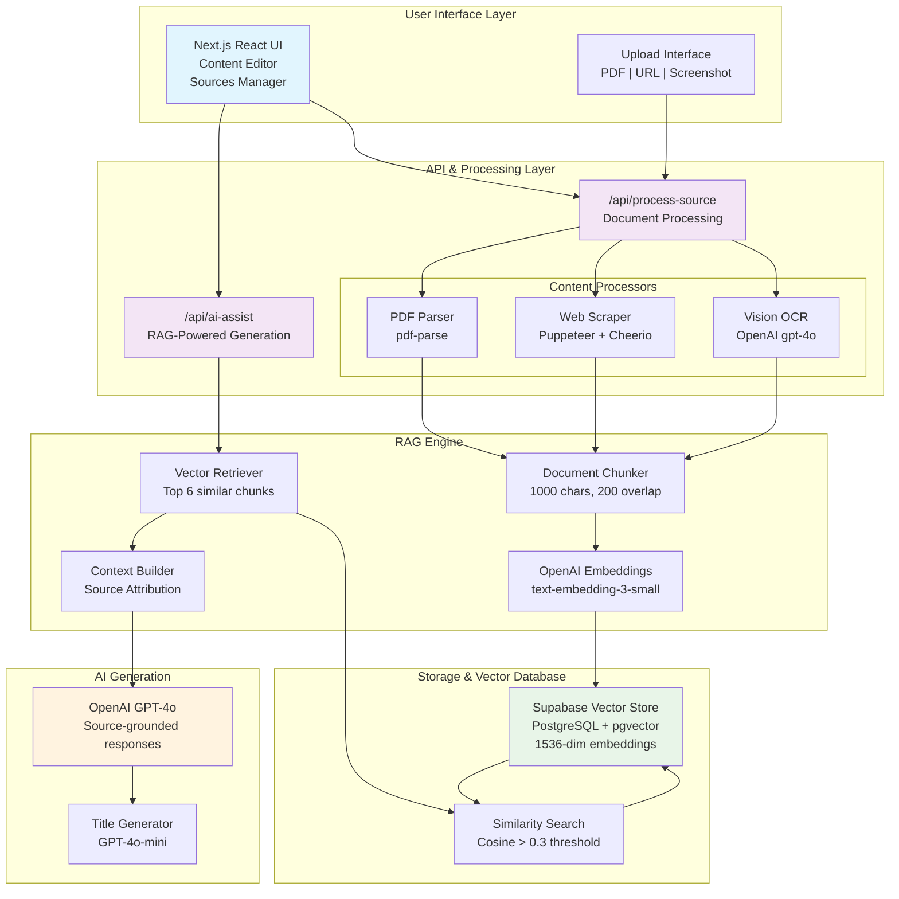
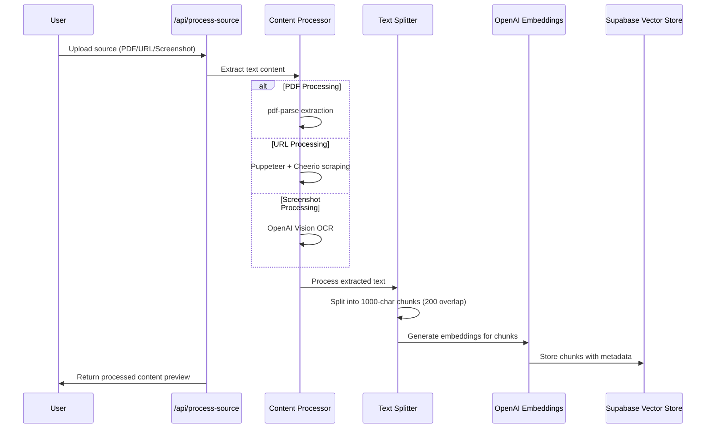
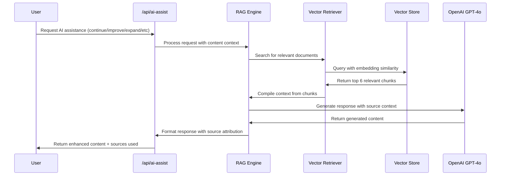

# Current System Architecture & Process Flows
**Date: January 4, 2025**  
**Version: RAG-Powered Content Writer v2.0**

## 🏗️ **System Overview**

The Agentic PDF Processor has evolved into a sophisticated **RAG-powered content writing platform** that intelligently combines user-uploaded sources with advanced AI assistance. The system automatically processes, indexes, and retrieves relevant information from multiple source types to generate authentic, well-sourced content.

## 📊 **High-Level Architecture**



## 🔄 **Core Process Flows**

### **1. Source Processing Pipeline**



### **2. RAG-Powered Content Generation**



## 🛠️ **Technology Stack**

### **Frontend**
- **Framework**: Next.js 15.5.2 (App Router)
- **UI Library**: React 19.1.0
- **Styling**: Tailwind CSS 3.4.17
- **PDF Viewing**: pdfjs-dist 5.4.149, react-pdf 10.1.0
- **PDF Export**: jsPDF 3.0.2
- **State Management**: Zustand 5.0.8, localStorage

### **Backend & APIs**
- **Runtime**: Next.js API Routes (App Router)
- **Language**: TypeScript 5
- **PDF Processing**: pdf-parse 1.1.1
- **Web Scraping**: Puppeteer 24.17.1, Cheerio 1.1.2
- **OCR**: OpenAI Vision API (gpt-4o)

### **RAG & AI Infrastructure**
- **RAG Framework**: Langchain (langchain, @langchain/community, @langchain/openai)
- **Vector Database**: Supabase with pgvector extension
- **Embeddings**: OpenAI text-embedding-3-small (1536 dimensions)
- **Text Splitting**: RecursiveCharacterTextSplitter
- **LLM**: OpenAI GPT-4o, GPT-4o-mini

### **Database & Storage**
- **Vector Store**: Supabase PostgreSQL with pgvector
- **File Storage**: Supabase Storage
- **Document Metadata**: JSONB with source tracking

## 🔍 **RAG Implementation Details**

### **Document Processing Strategy**
```typescript
// Chunking Configuration
const CHUNK_SIZE = 1000;      // Optimal for context windows
const CHUNK_OVERLAP = 200;    // Maintains context continuity
const SEPARATORS = ['\n\n', '\n', '. ', '! ', '? ', ';', ',', ' ', ''];
```

### **Vector Search Configuration**
```sql
-- Similarity search function
CREATE FUNCTION match_documents_embeddings(
  filter jsonb,
  match_count int,
  query_embedding vector(1536)
) RETURNS TABLE (
  id uuid, content text, metadata jsonb, similarity float
) AS $$
  SELECT id, content, metadata,
    1 - (embedding <=> query_embedding) AS similarity
  FROM documents_embeddings
  WHERE 1 - (embedding <=> query_embedding) > 0.3
  ORDER BY similarity DESC LIMIT match_count;
$$;
```

### **RAG Query Process**
1. **Query Processing**: User input → OpenAI embeddings
2. **Similarity Search**: Vector comparison (cosine similarity > 0.3)
3. **Context Assembly**: Top 6 chunks → structured context
4. **LLM Generation**: GPT-4o with source context → response
5. **Source Attribution**: Track and cite document sources

## 📁 **Data Models**

### **Vector Store Schema**
```sql
CREATE TABLE documents_embeddings (
  id UUID PRIMARY KEY,
  content TEXT NOT NULL,              -- Chunk content
  metadata JSONB NOT NULL,            -- Source metadata
  embedding vector(1536) NOT NULL,    -- OpenAI embeddings
  created_at TIMESTAMPTZ DEFAULT NOW()
);
```

### **Metadata Structure**
```typescript
interface ChunkMetadata {
  sourceId: string;           // Unique source identifier
  sourceName: string;         // Display name
  sourceType: 'pdf' | 'url' | 'screenshot';
  chunkId: string;           // Unique chunk identifier
  chunkIndex: number;        // Position in document
  totalChunks: number;       // Total chunks for document
  chunkSize: number;         // Character count
  uploadedAt: string;        // ISO timestamp
}
```

## 🚦 **API Endpoints**

### **Core Processing**
- **`POST /api/process-source`** - Process uploaded sources
- **`POST /api/ai-assist`** - RAG-powered content generation
- **`GET /api/process-for-rag`** - Manual RAG operations

### **Testing & Debug**
- **`GET /api/test-connection`** - Verify system connections
- **`POST /api/debug-rag`** - Debug vector search
- **`POST /api/simple-rag`** - Test RAG functionality

## ⚡ **Performance Optimizations**

### **Vector Search**
- **Indexing**: IVFFlat index for fast similarity search
- **Threshold**: 0.3 similarity threshold for relevant results
- **Retrieval**: Top 6 chunks with Maximum Marginal Relevance

### **Content Processing**
- **Streaming**: Non-blocking document processing
- **Batching**: Process embeddings in batches of 10
- **Caching**: Server-side caching with Next.js

### **Token Optimization**
- **Smart Chunking**: 1000-char chunks prevent token overflow
- **Context Limiting**: Maximum 6 chunks per query
- **Model Selection**: GPT-4o for quality, GPT-4o-mini for speed

## 🔐 **Environment Configuration**

```env
# Core APIs
OPENAI_API_KEY=sk-proj-...
NEXT_PUBLIC_SUPABASE_URL=https://your-project.supabase.co
SUPABASE_SERVICE_ROLE_KEY=eyJhbGciOiJIUzI1NiI...

# Optional: Rate limiting and monitoring
VERCEL_ENV=development
```

## 🎯 **AI Assist Actions**

### **Available Operations**
1. **Continue** - Natural content continuation with source context
2. **Improve** - Enhance clarity and structure with supporting evidence  
3. **Expand** - Add relevant details from source documents
4. **Rewrite** - Restructure while maintaining source authenticity
5. **Summarize** - Concise summaries with key source insights

### **Response Features**
- **Source Attribution** - Automatic citation of used documents
- **Title Suggestions** - AI-generated titles for content
- **Token Estimates** - Usage tracking and optimization
- **Fallback Handling** - Graceful degradation when RAG unavailable

## 📈 **Scalability & Future Considerations**

### **Current Capabilities**
- **Unlimited Sources** - No context window limitations
- **Multi-format Support** - PDFs, URLs, screenshots
- **Real-time Processing** - Immediate source availability
- **Intelligent Retrieval** - Semantic similarity matching

### **Potential Enhancements**
- **Conversational Memory** - Multi-turn content refinement
- **Advanced Chunking** - Semantic-aware document splitting
- **Source Ranking** - Relevance scoring and prioritization
- **Collaborative Features** - Multi-user document sharing

## 🔄 **Daily Evolution Process**

The architecture is designed for rapid iteration:

1. **Morning**: Review usage analytics and error logs
2. **Development**: Implement improvements based on user feedback
3. **Testing**: Validate changes with comprehensive test suite
4. **Documentation**: Update this architecture doc with changes
5. **Deployment**: Deploy improvements with zero downtime

---

**Last Updated**: January 4, 2025  
**Next Review**: January 5, 2025  
**Maintained By**: Development Team

> This document reflects the current production state and will be updated daily as the system evolves.
