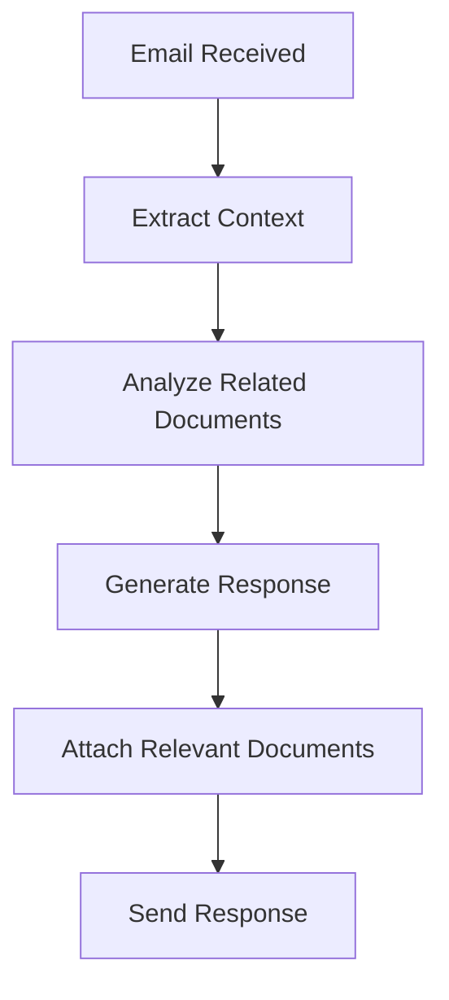
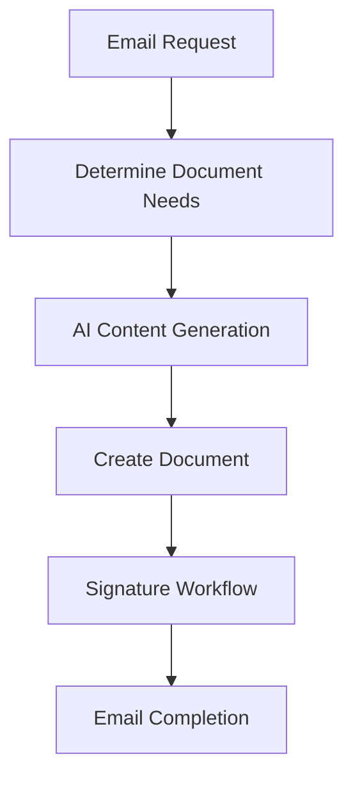
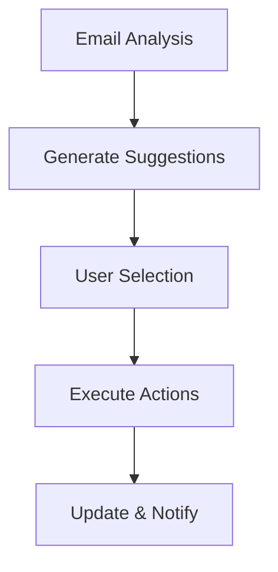

# 📧 Email Integration & Smart Workflow Examples

## 🌟 Overview

The Gmail Integration Agent transforms your email experience by intelligently connecting email communication with document processing workflows. This creates seamless email-to-document and document-to-email automation with AI-powered content generation.

---

## 📋 Use Case 1: Client Contract Response Workflow

### Scenario: Responding to Contract Review Requests

**Initial Email Received:**
```
From: john.smith@techcorp.com
Subject: Contract Review - Service Agreement Q1 2024
Date: Today, 9:15 AM

Hi [Your Name],

Thank you for sending the service agreement. I've reviewed the document and have a few questions:

1. Can we adjust the payment terms from NET 30 to NET 45?
2. The liability cap seems low at $50K - can we increase to $200K?
3. We'd like to add a force majeure clause

Please let me know if these changes are acceptable. We're hoping to finalize this by end of week.

Best regards,
John Smith
VP of Operations, TechCorp
```

### 🧠 AI-Powered Workflow Response

#### Step 1: Email Context Extraction
```typescript
// Automatically extracted context
{
  "sender": {
    "email": "john.smith@techcorp.com",
    "name": "John Smith",
    "role": "VP of Operations",
    "company": "TechCorp"
  },
  "urgencyLevel": "high", // "end of week" deadline detected
  "sentiment": "professional",
  "extractedEntities": [
    { "type": "payment_terms", "value": "NET 45", "context": "requested_change" },
    { "type": "liability_amount", "value": "$200K", "context": "requested_increase" },
    { "type": "clause_request", "value": "force majeure", "context": "addition" },
    { "type": "deadline", "value": "end of week", "context": "urgency" }
  ],
  "suggestedResponseType": "contract_negotiation_response",
  "requiredActions": [
    "review_contract_terms",
    "generate_amended_contract", 
    "create_response_email"
  ]
}
```

#### Step 2: Smart Document Suggestions
```
🧠 Document Intelligence Agent Analysis:

📄 Related Document Found: "Service_Agreement_TechCorp_Q1_2024.pdf"
📊 Document Type: Contract
🎯 Suggested Actions:

1. ✏️ Edit Contract Terms (Confidence: 92%)
   • Update payment terms: NET 30 → NET 45
   • Increase liability cap: $50K → $200K  
   • Add force majeure clause template

2. 📧 Generate Professional Response (Confidence: 89%)
   • Acknowledge requested changes
   • Provide modified contract attachment
   • Confirm timeline and next steps

3. ✍️ Create Signature Workflow (Confidence: 85%)
   • Set up DocuSign workflow for final version
   • Include both parties in signing sequence
```

#### Step 3: AI Contract Amendment
```
🎨 PDF Editor Agent Processing:

Automatically applying requested changes:
✅ Payment Terms: "Payment due within forty-five (45) days of invoice date"
✅ Liability Cap: "Total liability shall not exceed $200,000"
✅ Force Majeure: Added standard force majeure clause (Section 12)

📄 Version Created: Service_Agreement_TechCorp_Q1_2024_v2.pdf
🔄 Change Summary: 3 modifications applied based on client feedback
```

#### Step 4: AI Response Generation
```
📧 Gmail Integration Agent Generated Response:

From: [Your Name] <your.email@company.com>
To: john.smith@techcorp.com
Subject: Re: Contract Review - Service Agreement Q1 2024 - Amended Version
Date: Today, 10:30 AM

Hi John,

Thank you for your prompt review of the service agreement. I'm pleased to confirm that we can accommodate all three requested modifications:

✅ Payment Terms: Updated to NET 45 days as requested
✅ Liability Cap: Increased to $200,000 to align with your requirements  
✅ Force Majeure: Added comprehensive force majeure clause (Section 12)

Please find the amended contract attached. All changes are highlighted for easy review. If this version meets your requirements, I can set up the electronic signing workflow to have this finalized by Thursday.

Next steps:
1. Your review of the amended version (by Wednesday)
2. Electronic signature workflow initiation (Wednesday evening)
3. Contract execution (by Thursday)

Please let me know if you need any clarifications or have additional concerns.

Best regards,
[Your Name]

📎 Attachments:
• Service_Agreement_TechCorp_Q1_2024_v2.pdf (245 KB)
• Change_Summary_Report.pdf (89 KB)
```

#### Step 5: Proactive Follow-up Suggestions
```
💡 Document Intelligence Suggestions:

Since this is a contract negotiation:
🔔 Set reminder for Wednesday afternoon if no response received
📋 Prepare DocuSign workflow template for quick deployment
📊 Track this as high-priority deal in CRM integration
✉️ Schedule follow-up email template for Thursday morning
```

---

## 📋 Use Case 2: Invoice Processing & Dispute Resolution

### Scenario: Handling Invoice Dispute Email

**Problem Email Received:**
```
From: accounts.payable@megacorp.com  
Subject: URGENT: Invoice Discrepancy - INV-2024-0156
Date: Today, 8:42 AM

Hi,

We received invoice INV-2024-0156 dated March 15th for $12,850. However, our purchase order PO-45781 was for $11,200. 

There's a $1,650 discrepancy that needs immediate clarification. We need:

1. Detailed breakdown of charges
2. Explanation of additional costs  
3. Supporting documentation

This is blocking payment processing. Please resolve ASAP.

Best,
Susan Chen
Accounts Payable Manager
MegaCorp Industries
```

### 🧠 AI-Powered Resolution Workflow

#### Step 1: Intelligent Document Discovery
```typescript
// AI analyzes email and searches for related documents
{
  "searchQuery": "invoice INV-2024-0156 OR MegaCorp OR PO-45781",
  "foundDocuments": [
    {
      "id": "doc_789",
      "filename": "INV-2024-0156_MegaCorp.pdf",
      "type": "invoice",
      "amount": "$12,850",
      "status": "sent"
    },
    {
      "id": "doc_790", 
      "filename": "PO-45781_MegaCorp_Original.pdf",
      "type": "purchase_order",
      "amount": "$11,200",
      "status": "processed"
    },
    {
      "id": "doc_791",
      "filename": "Work_Order_Change_MegaCorp_March.pdf", 
      "type": "change_order",
      "amount": "$1,650",
      "status": "completed"
    }
  ]
}
```

#### Step 2: Automated Discrepancy Analysis
```
🔍 Data Extraction Agent Analysis:

📊 Invoice Breakdown:
• Original PO Amount: $11,200
• Additional Work Order: $1,650  
• Total Invoiced: $12,850
• Discrepancy: $0 (Match found!)

🎯 Resolution Strategy:
The "discrepancy" is actually a valid additional work order (doc_791) that was approved on March 18th but may not have been communicated to accounts payable.
```

#### Step 3: Smart Document Organization
```
📚 PDF Organization Agent Actions:

Creating comprehensive response package:
1. 📄 Combined_Invoice_Package_MegaCorp.pdf
   • Page 1-2: Original Invoice INV-2024-0156
   • Page 3-4: Original Purchase Order PO-45781  
   • Page 5-7: Work Order Change Authorization
   • Page 8: Detailed Cost Breakdown Summary

2. 📊 Cost_Breakdown_Summary.pdf
   • Itemized breakdown of all charges
   • Timeline of authorizations
   • Reference to approving manager
```

#### Step 4: AI Response with Complete Documentation
```
📧 Generated Professional Response:

From: [Your Name] <your.email@company.com>
To: accounts.payable@megacorp.com
CC: project.manager@megacorp.com
Subject: Re: Invoice INV-2024-0156 - Resolution & Documentation
Date: Today, 9:15 AM

Hi Susan,

Thank you for bringing this to my attention. I've investigated the discrepancy and found the resolution.

**Summary:**
The $1,650 difference represents authorized additional work that was approved on March 18th via Work Order Change #WOC-2024-033. This may not have been communicated to your accounts payable team.

**Detailed Breakdown:**
• Original PO-45781: $11,200 ✅
• Additional Work (WOC-2024-033): $1,650 ✅  
• Total Invoice Amount: $12,850 ✅

**Documentation Attached:**
1. Complete invoice package with all supporting documents
2. Detailed cost breakdown summary
3. Work order change authorization (signed by Tom Wilson, Project Manager)

The additional work involved emergency server maintenance on March 16-17, which was pre-approved by your project team due to the critical nature of the issue.

This should resolve the payment processing block. Please let me know if you need any additional documentation.

Best regards,
[Your Name]

📎 Attachments:
• Combined_Invoice_Package_MegaCorp.pdf (420 KB)
• Cost_Breakdown_Summary.pdf (156 KB)
```

---

## 📋 Use Case 3: Proposal Response Generation

### Scenario: RFP Response Email

**RFP Email Received:**
```
From: procurement@retailchain.com
Subject: RFP Response Request - IT Infrastructure Upgrade
Date: Today, 11:30 AM

Hello,

We're requesting proposals for our IT infrastructure upgrade project. Requirements attached in RFP_RetailChain_2024.pdf.

Key requirements:
- 50 retail locations
- Cloud migration strategy  
- 18-month timeline
- Budget: $2.5-4M

Proposals due: March 30th (2 weeks)
Decision by: April 15th

Please confirm receipt and timeline for your response.

Thanks,
Michael Torres
Procurement Director
Retail Chain Corp

📎 RFP_RetailChain_2024.pdf
```

### 🧠 AI-Powered Proposal Workflow

#### Step 1: RFP Document Analysis
```
📄 Document Analysis Agent Processing:

📊 RFP Analysis Results:
• Document Type: Request for Proposal (96% confidence)
• Industry: Retail Technology
• Project Size: Enterprise ($2.5-4M budget)
• Timeline: 18 months implementation
• Complexity: High (multi-location, cloud migration)

🎯 Key Requirements Extracted:
• 50 retail locations infrastructure
• Cloud migration from on-premise
• Point-of-sale system integration
• Security compliance (PCI DSS)
• 24/7 support requirements
• Staff training components
```

#### Step 2: Smart Content Brainstorming
```
🧠 AI Content Writing Engine:

💡 Proposal Structure Suggestions:
1. Executive Summary (focus on retail expertise)
2. Technical Approach (cloud-first strategy)  
3. Implementation Timeline (phased rollout)
4. Team Qualifications (retail IT experience)
5. Cost Structure (competitive but comprehensive)
6. Risk Mitigation (business continuity focus)

✍️ Key Value Propositions:
• "Zero-downtime migration strategy"
• "Retail-specific cloud architecture"
• "24/7 support with 4-hour response SLA"
• "Staff training included in all packages"
```

#### Step 3: AI-Generated Proposal Content
```
🎨 PDF Creation Agent Output:

Creating: Proposal_RetailChain_IT_Upgrade_2024.pdf

📋 Executive Summary:
"Our retail-focused IT infrastructure solution addresses Retail Chain Corp's unique multi-location requirements through a proven cloud-first approach. With 15+ years of retail technology experience and 200+ successful store deployments, we understand the critical importance of zero-downtime operations during your digital transformation.

Our phased implementation strategy minimizes business disruption while delivering immediate benefits. Phase 1 focuses on critical infrastructure migration, Phase 2 on point-of-sale integration, and Phase 3 on advanced analytics and reporting capabilities."

📊 Technical Approach:
"We propose a hybrid-cloud architecture utilizing AWS retail-optimized services with dedicated MPLS connections to ensure consistent performance across all 50 locations..."

💰 Investment Summary:
• Infrastructure: $2,850,000
• Implementation: $450,000  
• Training: $200,000
• Total: $3,500,000 (within budget range)
```

#### Step 4: Professional Response Email
```
📧 Generated Response:

From: [Your Name] <your.email@company.com>
To: procurement@retailchain.com
Subject: Re: RFP Response - Retail IT Infrastructure Upgrade Proposal
Date: Today, 2:45 PM

Dear Michael,

Thank you for the opportunity to propose on Retail Chain Corp's IT infrastructure upgrade project. We've reviewed your requirements and are excited to present a solution tailored specifically for your multi-location retail environment.

**Proposal Highlights:**
✅ Zero-downtime migration strategy
✅ Retail-optimized cloud architecture  
✅ Phased 18-month implementation timeline
✅ Comprehensive staff training program
✅ Investment of $3.5M (within your budget range)

**Our Retail Expertise:**
• 200+ successful retail technology deployments
• 15+ years of retail IT infrastructure experience
• Average 99.7% uptime across retail clients
• PCI DSS compliance specialists

**Next Steps:**
I'd welcome the opportunity to discuss our approach and answer any questions. Would you be available for a brief call this week to review our key differentiators?

Our complete proposal is attached, with detailed technical specifications, implementation timeline, and investment breakdown.

Best regards,
[Your Name]
Senior Solutions Architect

📎 Attachments:
• Proposal_RetailChain_IT_Upgrade_2024.pdf (1.2 MB)
• Case_Studies_Retail_Deployments.pdf (890 KB)
• Technical_Architecture_Diagram.pdf (340 KB)
```

#### Step 5: Automated Follow-up Suggestions
```
💡 Smart Follow-up Strategy:

🗓️ Scheduled Actions:
• Day 3: "Checking in on proposal questions" email
• Day 7: "Additional information available" email  
• Day 12: "Final questions before deadline" email
• Day 14: "Proposal submitted confirmation" email

📋 Preparation Tasks:
• Schedule proposal presentation for next week
• Prepare technical deep-dive materials
• Coordinate with implementation team for questions
• Set up proposal tracking dashboard
```

---

## 🔄 Gmail Integration Workflow Patterns

### **Pattern 1: Email → Document Analysis → Response**


### **Pattern 2: Email → Document Creation → Workflow**


### **Pattern 3: Email → Smart Suggestions → Action**


---

## 🎯 Smart Suggestion Examples by Document Type

### **📄 Contract Documents**
When a contract is uploaded or referenced in email:
- ✍️ "Set up e-signature workflow for all parties"
- ✏️ "Review key terms and clauses for potential issues"  
- 📧 "Send to legal team for compliance review"
- 📚 "Compare with similar contracts for consistency"
- 🔔 "Set renewal reminders for 60 days before expiration"

### **🧾 Invoice Documents**
When processing invoices from email:
- 📊 "Merge with related purchase orders and receipts"
- 📧 "Forward to accounting with approval workflow"
- ✏️ "Flag discrepancies for review"
- 📚 "Extract key data for expense tracking"
- ⏰ "Set payment reminders based on terms"

### **📋 Report Documents** 
When reports are shared via email:
- 📚 "Extract executive summary pages"
- 📧 "Distribute to relevant stakeholders"
- 🎨 "Create presentation from key findings"  
- 📊 "Generate dashboard from metrics"
- 📝 "Draft follow-up action items"

### **📨 Proposal Requests**
When RFP emails are received:
- 🎨 "Generate proposal outline from requirements"
- 📚 "Compile relevant case studies and credentials"
- ✍️ "Create customized response template"
- 📊 "Build pricing model from requirements"
- 📅 "Set up proposal timeline and milestones"

---

## 🚀 Advanced Integration Features

### **Learning & Adaptation**
- **Email Pattern Recognition**: Learn common email types and responses
- **Document Relationship Mapping**: Understand which documents typically go together
- **User Preference Learning**: Adapt suggestions based on user actions
- **Industry-Specific Optimization**: Tailor workflows for specific business domains

### **Collaboration Enhancement**
- **Team Workflows**: Coordinate multi-person document processes
- **Approval Chains**: Route documents through appropriate approval processes
- **Version Control**: Track document changes across email threads
- **Notification Management**: Smart notifications for relevant stakeholders

### **Security & Compliance**
- **Email Encryption**: Secure sensitive document transmissions
- **Access Control**: Document-level permissions and restrictions
- **Audit Trail**: Complete email and document interaction logging
- **Compliance Monitoring**: Ensure adherence to industry regulations

---

This Gmail integration transforms email from a simple communication tool into an intelligent document processing hub, creating seamless workflows that save hours of manual work while improving accuracy and consistency. 🎉
